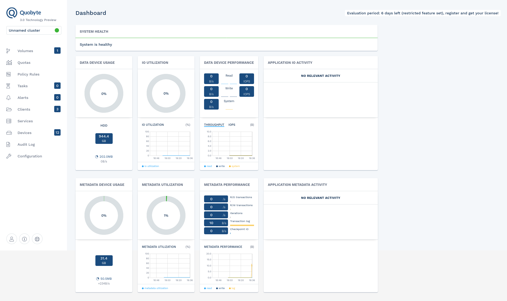

# Quobyte Requirements  

You can directly start to use the Free Edition of Quobyte with up to 150TB capacity and CSI support.
To access the Community support forum visit <https://support.quobyte.com> and sign up for a free Quobyte account.




## Table of Contents

- [Requirements](#requirements)
- [Quobyte cluster optimization](#quobyte-cluster-optimization)

## Requirements

* For production use the minimum node pool configuration is 4 or more worker nodes, each at least 8 cores with 32GB RAM. For functional testing you can run with a lower number of nodes, cores or memory. A smaller machine count will affect availability while less ressources will affect performance.  
* To guarantee stability and performance of a Quoybte storage system it is recommendet to run all storage pods on a dedicated node pool.
* Quobyte will work best with optimized network settings for your worker nodes. See "Quobyte cluster Optimization" below. 
* If you want to access the Quobyte cluster from the outside world (i.e. other k8s clusters, VMs), you need to make sure that all Quobyte services are reachable with all ports. For firewall planning etc. see [Quobyte Services](https://docs.quobyte.com/docs/16/latest/reference_services.html) for details. 

## Quobyte cluster optimization


Quobyte will send alerts if two network values are set to low. To optimize it you can tune your worker nodes with two sysctl values:

```
   net.core.rmem_max: '67108864'  
   net.core.wmem_max: '1048576'
```


