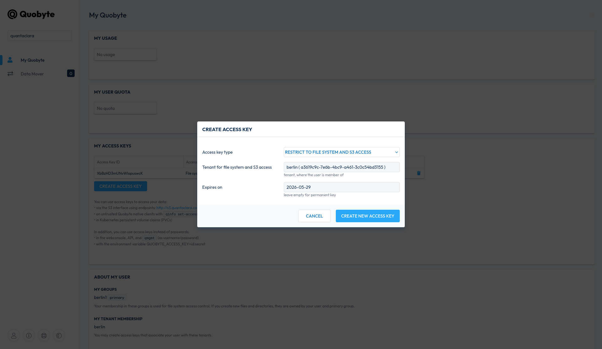

# Using Access Keys to consume Quobyte volumes

Access keys can be used to authenticate against a Quobyte storage system.
When consuming storage authentication is involved at different stages:

1. Creating and deleting a volume
2. Publish/ Unpublish a volume to a pod.

The first stage will require Quobyte privileges of a "tenant admin".
The second stage will require Quobyte privileges of a "tenant member".

Each of these steps can use different credentials, referenced in a Kubernetes
storage class.

To only use minimal necessary privileges this example uses different access keys per stage.
One access key, restricted to only API usage, belonging to a Quobyte user with "Tenant Admin" privileges. 
The other access key, restricted to "File system and S3 access" belonging to a user with only "Tenant Member" 
privileges. 
Both secrets are stored in different name spaces: The tenant admin in "kube-system" and the unprivileged one in 
the users current namespace.

The storage class (01_storage_class.yaml) does not reference access keys directly, but will refer to secret names used 
in the PVC definition (04_test-pvc.yaml) as annotation. 
This allows to have one generic storage class definition and flexible use of secrets when 
defining PVCs. 
In other words: Users can manage their secrets on their own.

The needed access keys can be created by users themselves using either the Quobyte
Webconsole, "qmgmt" CLI tooling or the Quobyte API.

